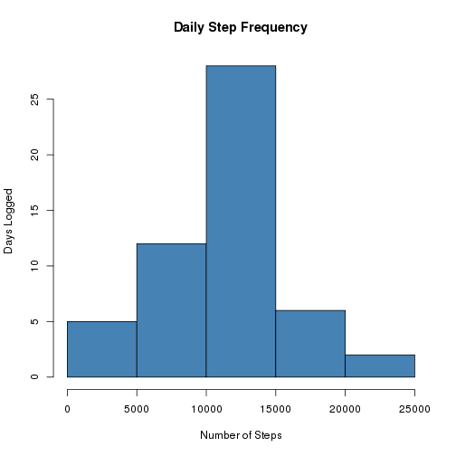
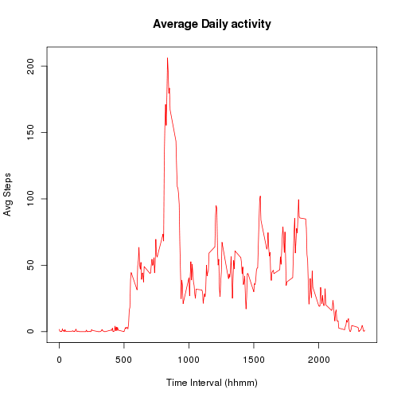
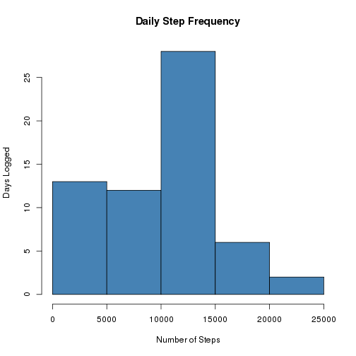
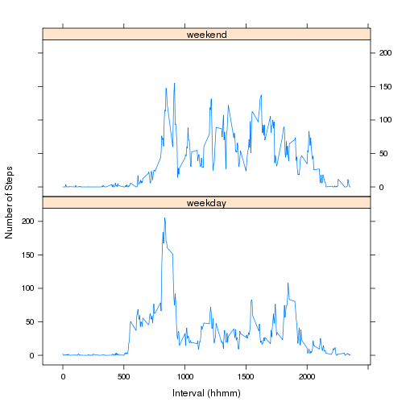

## Loading and preprocessing the data
Since the data is contained within the repository, check to see if it is unpacked and if not, do so before proceeding. Once unpacked, we load
it into `activity`. Specific transforms occur prior to their use.


```r
dataFile <- "activity.csv"
if (!file.exists(dataFile)) {
    unzip("activity.zip")
}
activity <- read.csv(dataFile)
rm(dataFile)            # Clean temporary variables
```

## What is mean total number of steps taken per day?

To determine the total number of steps taken each day, an aggregation using
the sum function is run for steps relative to the date.


```r
perDate <- aggregate(steps ~ date, activity, sum, na.rm=TRUE) 
hist(perDate$steps, 
     col="steelblue",
     main="Daily Step Frequency",
     xlab="Number of Steps",
     ylab="Days Logged")
```

 

From the `perDate` data calculated previously, calculating the mean and
median are single function calls.

```r
mean(perDate$steps,na.rm=TRUE)
```

```
## [1] 10766.19
```

```r
median(perDate$steps,na.rm=TRUE)
```

```
## [1] 10765
```

## What is the average daily activity pattern?

In this case, the desired aggregation is steps relative to the recorded
time interval, averaged across all days of the data.


```r
daily_avg <- aggregate(steps ~ interval, activity, mean, na.rm=TRUE)
plot(daily_avg$interval, daily_avg$steps, type="l",
     col="red",
     main="Average Daily activity",
     xlab="Time Interval (hhmm)",
     ylab="Avg Steps")
```

 

To identify the most active time interval, the data set can be subsetted for
the interval value that corresponds to the maximum average.

```r
daily_avg[daily_avg$steps == max(daily_avg$steps),"interval"]
```

```
## [1] 835
```

## Imputing missing values
### Calculate the number of rows with missing step data


```r
sum(is.na(activity$steps))
```

```
## [1] 2304
```

### Strategy for filling in NA data
For this analysis, the median value for the number of steps for a time
interval across all sample days will be used in the place of NA data. This 
seems "more likely" to be the number of steps taken. The mean will be more
sensitive to variance between many zero step days and larger samples.

### Create the newly filled data set
Calculating the medians for each time interval is an aggregation similar 
to the mean aggregation before, but applying the median function. This data
can then be merged with the existing activity data and NA step values 
replaced with the median values.


```r
daily_med <- aggregate(steps ~ interval, activity, median, na.rm=TRUE)

actFill <- merge(activity, daily_med,
                   by.y = "interval", 
                   by.x = "interval", 
                   all.x = TRUE)
rm(daily_med)
actFill$steps <- actFill$steps.x
actFill[is.na(actFill$steps.x),"steps"] <- 
    actFill[is.na(actFill$steps.x), "steps.y"]
# Reordering and dropping temporary columns
actFill <- actFill[,c("steps", "interval", "date")]
```

### Prepare a histogram of the new data set
With the new data set `actFill`, an aggregation relating steps to date
can demonstrate the effect of this choice of strategy.


```r
filledByDate <- aggregate(steps ~ date, actFill, sum, na.rm=TRUE) 
hist(filledByDate$steps, 
     col="steelblue",
     main="Daily Step Frequency",
     xlab="Number of Steps",
     ylab="Days Logged")
```

 

The additional values appear to have primarily boosted the frequency of low
step days, suggesting that the NA data covers large days of data instead of
small pockets of missing values.

The mean and median values shift downward as well:

```r
mean(filledByDate$steps,na.rm=TRUE)
```

```
## [1] 9503.869
```

```r
median(filledByDate$steps,na.rm=TRUE)
```

```
## [1] 10395
```


## Are there differences in activity patterns between weekdays and weekends?
Setting up a factor variable leverages the use of the `weekdays()` function
which is used to identify TRUE (weekday) and FALSE (weekend) for a 2-level
factor variable.


```r
actFill$timewk <- !(weekdays(as.Date(as.character(actFill$date)))
                    %in% c("Saturday", "Sunday"))
actFill$timewk <- factor(actFill$timewk, 
                         levels=c(TRUE, FALSE), 
                         labels=c("weekday", "weekend"))
```

To determine the average number of steps per time interval, another
aggregation is performed for steps relative to both interval and the newly
created factor variable `timewk`


```r
tow_avg <- aggregate(steps ~ interval + timewk, actFill, mean, na.rm=TRUE)
library(lattice)
xyplot(steps ~ interval | timewk, tow_avg, 
       layout=c(1,2), 
       type="l",
       xlab="Interval (hhmm)",
       ylab="Number of Steps")
```

 

